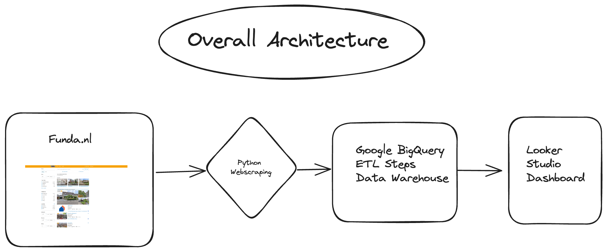
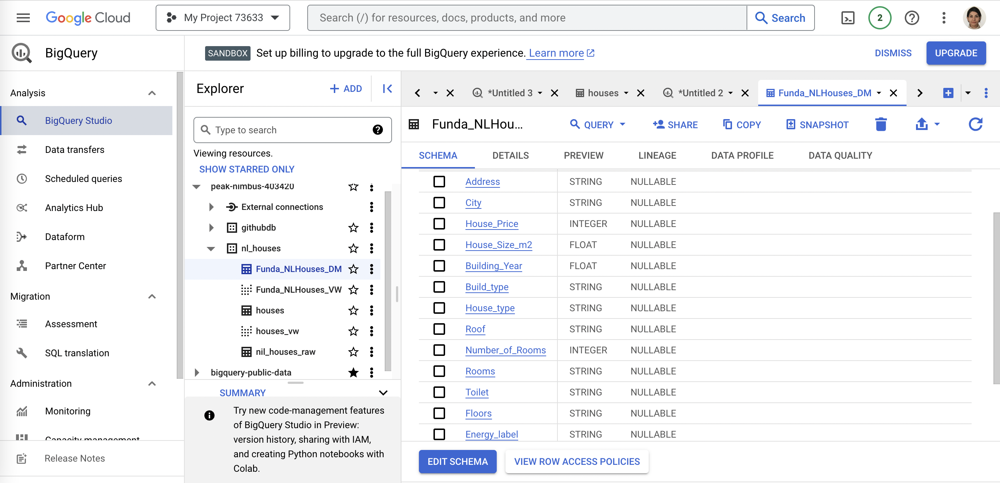
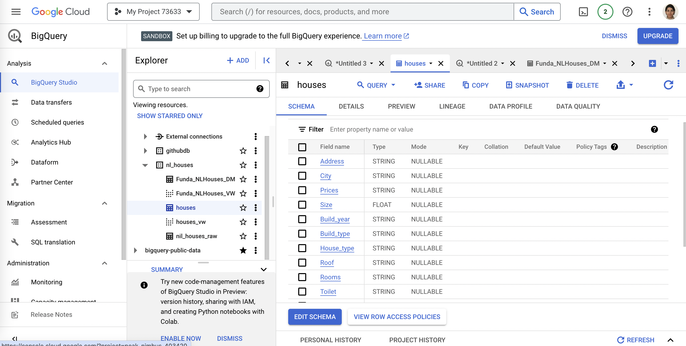
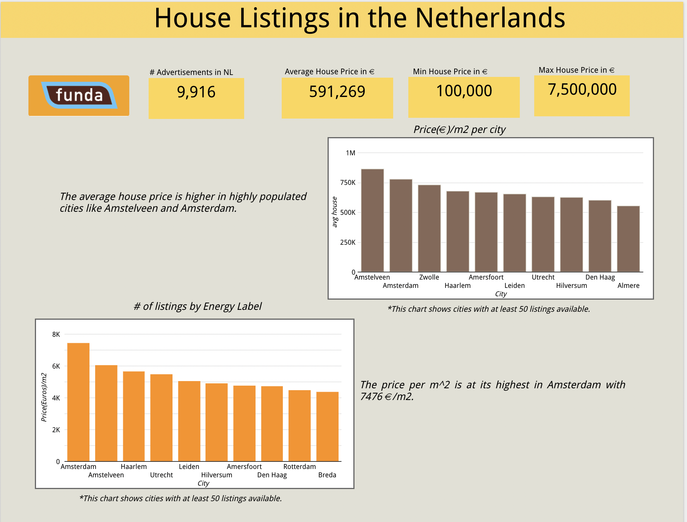
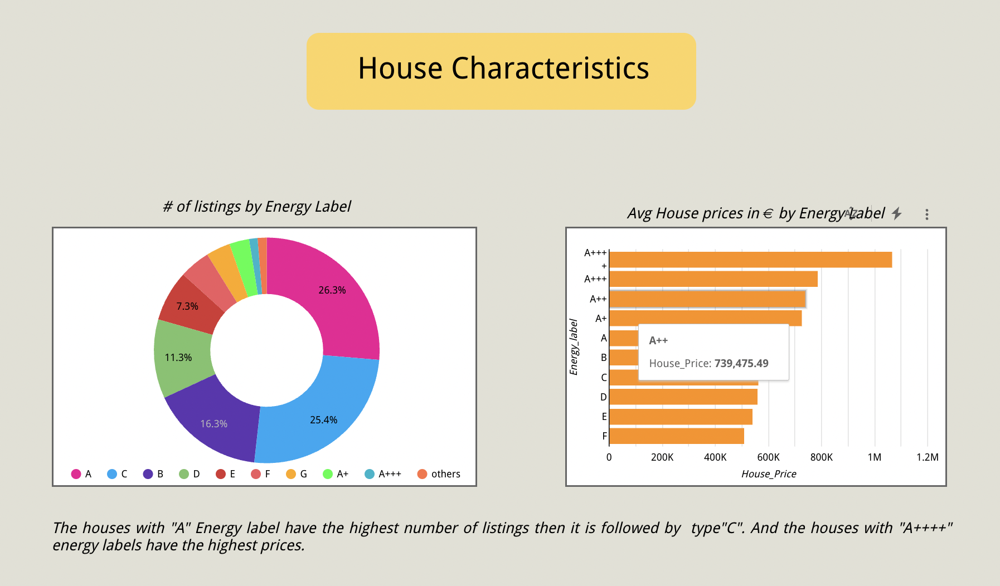
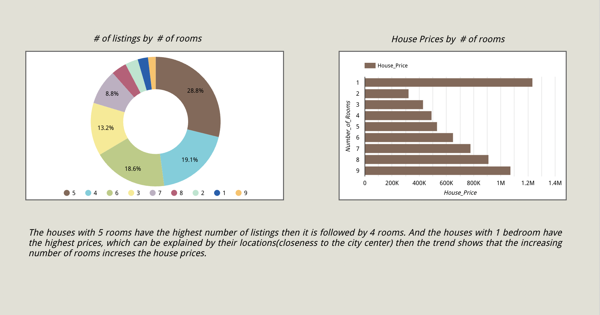
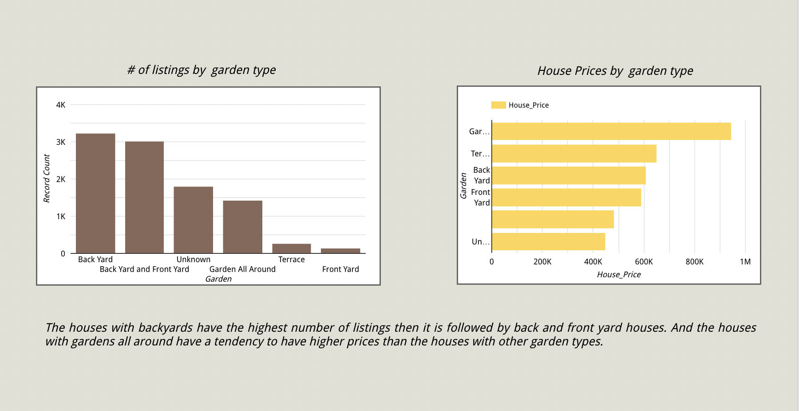
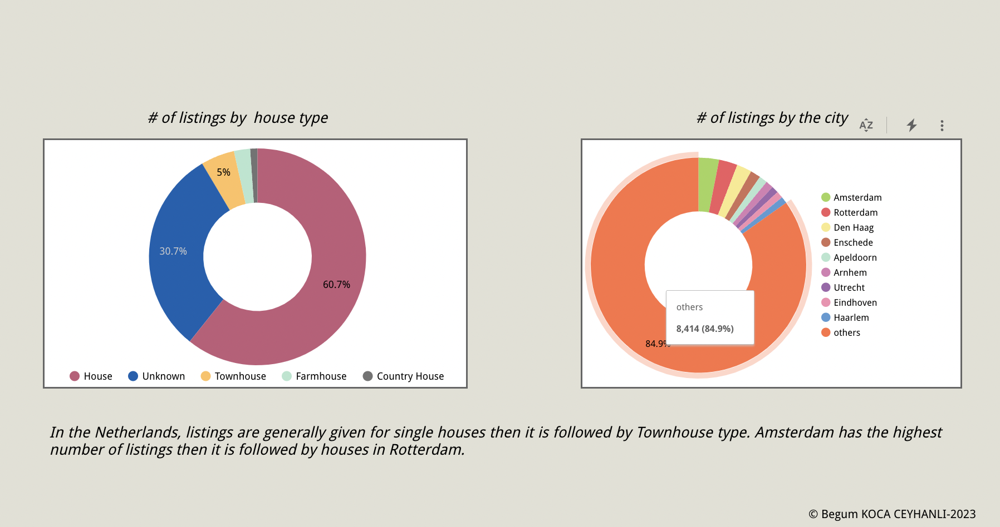

<div align="center">
 <br />


# Dutch House Prices Analysis 


</div>

## :bookmark_tabs: Menu

- [Business Problem](#Business-Problem)
- [Web Scraping](#Web-Scraping)
- [Google BigQuery](#Google-BigQuery)
- [Looker Studio](#Looker-Studio)
- [Folder Structure](#closedbook-results)
- [Requirements](#exclamation-requirements)
- [Author](#smiley_cat-author)

## Business problem


The Netherlands stands out as one of the most sought-after countries to reside in Europe, renowned for its picturesque landscapes and historic architectural marvels. Nevertheless, among the paramount challenges that individuals may encounter in this splendid nation is the quest for suitable housing options. To address this concern, I have meticulously crafted a comprehensive end-to-end analysis, elucidating the prevailing housing market conditions in the Netherlands.

Initiating the project, one of the foremost hurdles entailed the procurement of accurate datasets and the development of robust data ingestion pipelines. Consequently, I made the strategic choice to source data from one of the Netherlands' premier real estate platforms, Funda.nl. With the data collected thorough web scraping methodology, the subsequent phase of the project centered on data cleaning and transformation. To effectively execute this critical step, I leveraged Google BigQuery, capitalizing on its native integration with Looker Studio, where I meticulously constructed the data dashboards.

This study provides a concise overview of house prices across various cities, along with the key attributes of houses, encompassing details such as the number of rooms, energy types, and garden availability, all of which exert a significant influence on pricing dynamics. To facilitate this in-depth analysis, the extensive data resources of Funda.nl, a preeminent real estate website, were harnessed.

The architectural framework of the project is thoughtfully segmented into three main components, as follows:


- #### Data Collection <font color='gray'> (by webscraping using Python) </font>
- #### Data Preperation and ETL <font color='gray'>(by using Google BigQuery) </font>
- #### Data Visualization <font color='gray'>(by using Looker Studio) </font>


Here is the overall architecture flow:




# Web Scraping 
In this notebook, we will create a dataset of houses found from [Funda](https://www.funda.nl/) (Dutch real-estate website). In order to do this, we need to program a web bot to retrieve all the information for us. We will use a combination of [Selenium](https://selenium-python.readthedocs.io/) and [Beautifulsoup](https://www.crummy.com/software/BeautifulSoup/bs4/doc/) for this.

This notebook is part of my house prices analysis work in which we create a dataset and an accompanying web app.

For more details on the scraping code and libraries please refer to [scraping.ipynb](/Users/begumkoca/Documents/GitHub/HousePrices__Webscraper/scraping.ipynb)

# Google BigQuery 

#### Data Warehouse and ETL with SQL

In this part, data is loaded into BigQuery and null handling and transformation steps are performed by using SQL queries. Data exploration, data preperation and data modelling and validation has been completed.

```console
CREATE TABLE nl_houses.houses_dm AS
SELECT 
    Address,
    City,
    CASE 
      WHEN Price LIKE '%von%' THEN NULL
      WHEN Price LIKE '%Prijs%' THEN NULL
      WHEN Price LIKE '%Lisse%' THEN NULL
      ELSE Price
    END AS Prices,
    Lot_size__m2_ as Size,
    CASE
      WHEN Build_year LIKE '%Voor%' THEN NULL
      WHEN Build_year LIKE '%Na%' THEN NULL
      WHEN Build_year LIKE '%Bestaande%' THEN NULL
      ELSE Build_year
    END AS Build_year,
    CASE WHEN Build_type LIKE '%19%' THEN NULL
    ELSE Build_type
    END AS Build_type,
    House_type,
    CASE WHEN Roof LIKE '%19%' THEN NULL
    ELSE Roof
    END AS Roof,
    CASE 
      WHEN Rooms LIKE '%dak%' THEN NULL
      ELSE Rooms
    END As Rooms,
    CASE
      WHEN Toilet LIKE '%slaap%' THEN NULL
      ELSE Toilet
    END AS Toilet,
    Floors,
    CASE 
      WHEN Energy_label LIKE '%2 woonlagen%' THEN NULL
      WHEN Energy_label LIKE '%Alarm%' THEN NULL
      WHEN Energy_label LIKE '%Buiten%' THEN NULL
      WHEN Energy_label LIKE '%Lift%' THEN NULL
      WHEN Energy_label LIKE '%TV%' THEN NULL
      ELSE Energy_label
    END as Energy_label,
    Position,
    Garden
  FROM `peak-nimbus-403420.nl_houses.nil_houses_raw`
```


This is created as staging table to be able to prepare the final table do all the data type transformations in big query:


```console
CREATE OR REPLACE TABLE nl_houses.Funda_NLHouses_DM AS
SELECT 
      Address,
      City,
      CAST(Prices as int64) as House_Price,
      CAST(Size as float64) as House_Size_m2,
      CAST(Build_year as float64) as Building_Year,
      Build_type,
      CASE 
      WHEN House_type LIKE "%Eengezinswoning%" THEN "House"
      WHEN House_type LIKE "%Herenhuis%" THEN "Townhouse"
      WHEN House_type LIKE "%Woonboerderij%" THEN "Farmhouse"
      WHEN House_type LIKE "%Landhuis%" THEN "Country House"
      ELSE "Unknown"
      END House_type,
      Roof,
      CAST(LEFT(Rooms,1) as int64) as Number_of_Rooms,
      Rooms,
      Toilet,
      Floors,
      Energy_label,
      Position,
      CASE
      WHEN Garden LIKE "%Achtertuin en voortuin%" THEN "Back Yard and Front Yard"
      WHEN Garden LIKE "%Voortuin%" THEN "Front Yard"
      WHEN Garden LIKE "%Achtertuin%" THEN "Back Yard"
      WHEN Garden LIKE "%Tuin rondom%" THEN "Garden All Around"
      WHEN Garden LIKE "%terras%" THEN "Terrace"
      ELSE "Unknown"
      END Garden
FROM `peak-nimbus-403420.nl_houses.houses` 
```


Here are some screenshots from BigQuery to show how the schemas and tables look like:






# Looker Studio 

#### Visualizations

And as a final step Google BigQuery is connected with Looker Studio then the visualizations are performed.

To view the dashboard please use the [Dashboard](https://lookerstudio.google.com/u/0/reporting/9d2a20a9-d89e-4f6e-9f12-8943d33baf5d/page/ukNhD) link here.

And for a quick overview please refer to the below:








## :open_file_folder: Folder Structure

```
.
├── assets                                   # Images for notebook
├── scraping.ipynb                           # Main notebook
├── requirements.txt                         # Required packages
└── README.md
```

## :exclamation: Requirements

Found in [requirements.txt](/Users/begumkoca/Documents/GitHub/HousePrices__Webscraper/requirements.txt).

## :smiley_cat: Author

- [@begussimo](https://github.com/begussimo)